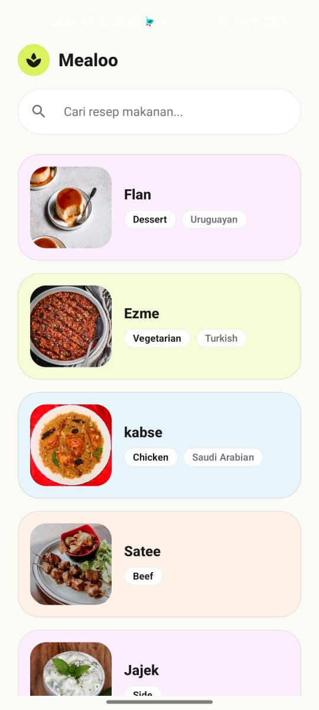
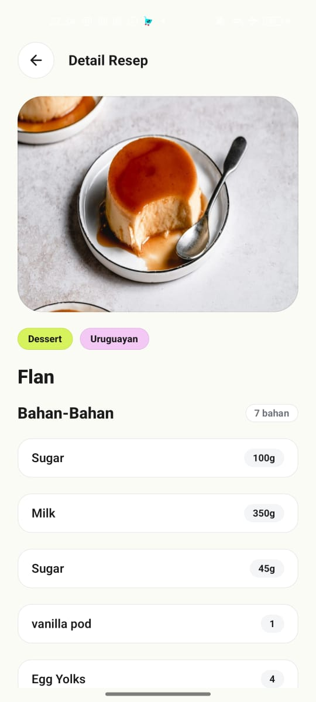

# Mealoo

Mealoo adalah aplikasi katalog resep makanan berbasis Android yang mengonsumsi REST API publik TheMealDB. Proyek ini dibangun menggunakan Kotlin, Jetpack Compose, Material Design 3, serta menerapkan pola arsitektur Model-View-ViewModel (MVVM).

## Tangkapan Layar

| Home Screen | Detail Screen |
| :---: | :---: |
|  |  |

## Fitur Aplikasi

### 1. Home Screen
- **Pencarian Real-Time:** Pencarian resep berdasarkan nama makanan menggunakan mekanisme debounce 400ms untuk meminimalisasi panggilan jaringan berlebih.
- **Daftar Resep (LazyColumn):** Menampilkan daftar resep dalam format kartu yang memuat gambar makanan, nama resep, label kategori, dan wilayah asal makanan.
- **Navigasi:** Navigasi menuju layar detail resep ketika salah satu kartu dipilih.

### 2. Detail Screen
- **Informasi Makanan:** Menampilkan foto makanan beresolusi penuh, nama resep, kategori, dan negara asal.
- **Daftar Bahan & Takaran:** Menampilkan daftar bahan makanan yang dipetakan langsung dengan takarannya secara terstruktur.
- **Instruksi Memasak:** Memproses teks instruksi dari API menjadi urutan langkah bernomor agar mudah dibaca.
- **Navigasi Kembali:** Tombol navigasi untuk kembali ke layar sebelumnya.

### 3. Penanganan Status UI (UiState)
- **Loading:** Menampilkan indikator proses saat data sedang diunduh.
- **Success:** Menampilkan data resep yang berhasil dimuat.
- **Empty:** Menampilkan pesan informatif apabila hasil pencarian tidak ditemukan.
- **Error:** Menampilkan pesan kesalahan serta tombol coba lagi (retry) apabila koneksi internet terputus atau terjadi kegagalan sistem.

## Arsitektur Aplikasi

Aplikasi mengimplementasikan pola arsitektur MVVM dengan alur data satu arah (Unidirectional Data Flow):

```
TheMealDB API -> Retrofit (MealApiService) -> Repository (MealRepositoryImpl) -> ViewModel (HomeViewModel / DetailViewModel) -> UI (HomeScreen / DetailScreen)
```

- **Model:** Mengelola representasi data dari API (`MealDto`, `MealResponse`) dan model domain aplikasi (`Meal`).
- **Repository:** Mengatur pengambilan data jaringan di thread IO menggunakan Coroutines serta memetakan DTO menjadi model domain.
- **ViewModel:** Mengelola status antarmuka menggunakan `StateFlow` dan menangani logika interaksi pengguna.
- **View (Compose):** Komponen deklaratif murni yang mengamati perubahan state dari ViewModel tanpa mengakses lapisan jaringan secara langsung.

## Struktur Direktori

```
app/src/main/java/com/pemmob/mealoo/
├── MainActivity.kt
├── data/
│   ├── model/
│   │   ├── Meal.kt
│   │   ├── MealDto.kt
│   │   ├── MealMapper.kt
│   │   └── MealResponse.kt
│   ├── remote/
│   │   ├── MealApiService.kt
│   │   └── RetrofitClient.kt
│   └── repository/
│       ├── MealRepository.kt
│       └── MealRepositoryImpl.kt
└── ui/
    ├── common/
    │   ├── StateViews.kt
    │   └── UiState.kt
    ├── detail/
    │   ├── DetailScreen.kt
    │   └── DetailViewModel.kt
    ├── home/
    │   ├── HomeScreen.kt
    │   ├── HomeViewModel.kt
    │   └── components/
    │       └── HomeComponents.kt
    ├── navigation/
    │   └── MealooNavigationGraph.kt
    └── theme/
        ├── Color.kt
        ├── Theme.kt
        └── Type.kt
```

## Teknologi dan Pustaka

- **Bahasa Pemrograman:** Kotlin 2.0+
- **UI Toolkit:** Jetpack Compose & Material 3
- **Navigasi:** AndroidX Navigation Compose
- **Asinkron & State:** Kotlin Coroutines & StateFlow
- **Networking:** Retrofit 2 & Gson Converter
- **Logging:** OkHttp Logging Interceptor
- **Pemuatan Gambar:** Coil Compose
- **Minimum SDK:** API 24 (Android 7.0)
- **Target SDK:** API 36 (Android 15)

## Panduan Instalasi dan Menjalankan Proyek

1. Clone repositori ke komputer lokal.
2. Buka proyek menggunakan Android Studio.
3. Sinkronkan dependensi Gradle melalui menu **File > Sync Project with Gradle Files**.
4. Hubungkan perangkat Android fisik (dengan USB Debugging aktif) atau jalankan Android Emulator.
5. Jalankan aplikasi melalui menu **Run > Run 'app'** atau melalui terminal:
   ```bash
   ./gradlew installDebug
   ```
